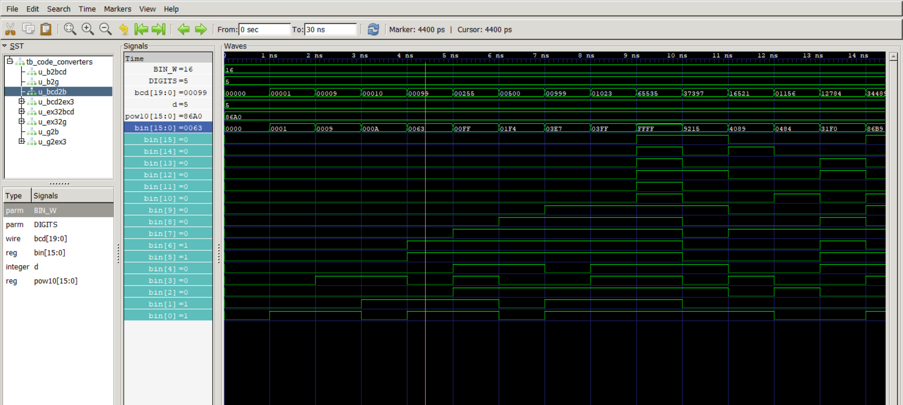
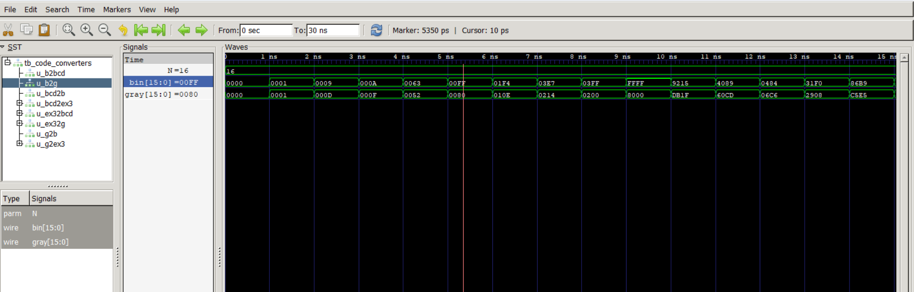
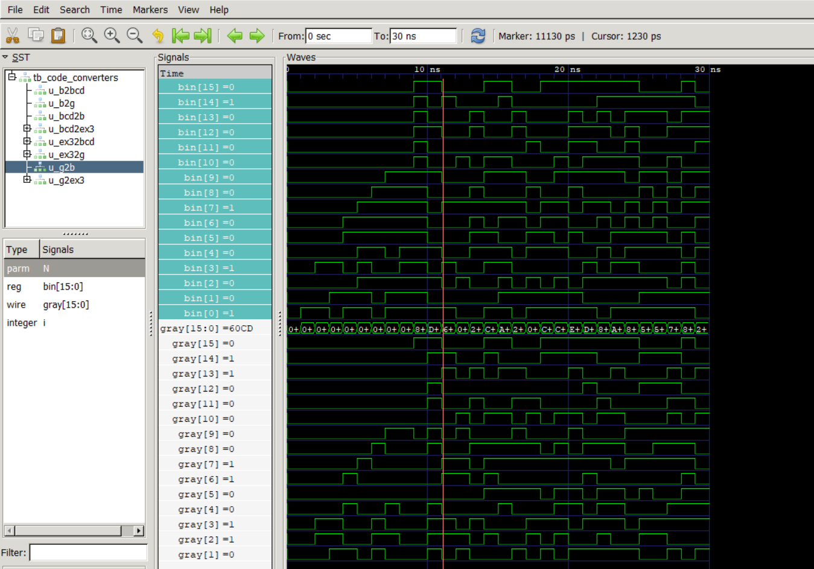
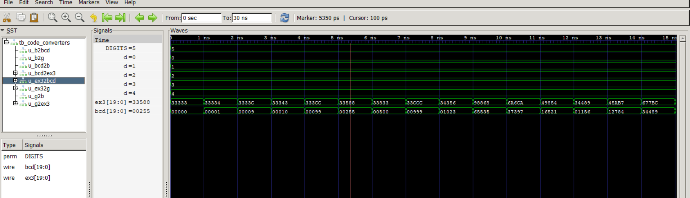
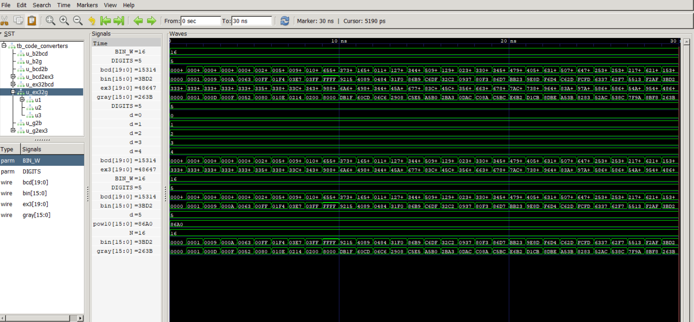
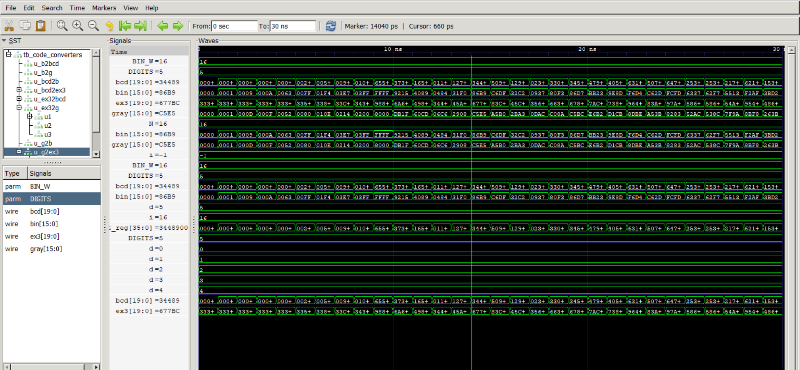

# Day 2 – Code Converters (Binary, BCD, Gray, Excess-3)

A collection of scalable RTL code converters with a universal self-checking testbench and waveform validation, built to demonstrate digital design and verification fundamentals for VLSI fresher roles.

## Overview
This project implements commonly used code converters in digital systems:
- Binary ↔ BCD  
- Binary ↔ Gray  
- BCD ↔ Excess-3  
- Excess-3 ↔ Gray  

The design supports **N-bit Binary and N-digit BCD**, allowing conversion of large values (e.g., >500, thousands, up to 65535 depending on parameters).

All converters are verified using a **universal self-checking SystemVerilog testbench**, and simulation results are validated with **GTKWave waveforms**.

## Folder Structure
02_code_converters/
├── rtl/          # Parameterized RTL for all converters
├── tb/           # Universal self-checking SystemVerilog testbench
├── screenshots/  # GTKWave waveform images
└── README.md

## How to Run (Icarus Verilog + GTKWave)

```bash
iverilog -g2012 rtl/*.v tb/tb_code_converters.sv -o sim.out
vvp sim.out
gtkwave waves_day2.vcd
```


---

## ✅ Step 5 — Verification Approach (This Sells Your DV Skills)

Add:

```md
## Verification Methodology
- One universal self-checking testbench verifies all converters
- Directed corner cases: 0, 9, 10, 99, 500, max value  
- Randomized tests for robustness  
- Round-trip checks:
  - Binary → BCD → Binary  
  - Binary → Gray → Binary  
  - BCD ↔ Excess-3  
  - Excess-3 ↔ Gray  
- Waveforms generated using VCD and analyzed in GTKWave
```

## Waveforms (Simulation Results)

### Binary → BCD


### BCD → Binary


### Binary → Gray


### Gray → Binary


### BCD → Excess-3


### Excess-3 → BCD


### Excess-3 → Gray


### Gray → Excess-3


---
## What This Project Demonstrates
- Strong fundamentals in number systems and digital logic  
- Clean, scalable RTL design using parameterization  
- Verification mindset: self-checking testbench, corner cases, waveforms  
- Professional code organization and documentation  

Suitable for VLSI Design Verification / RTL Fresher roles.
