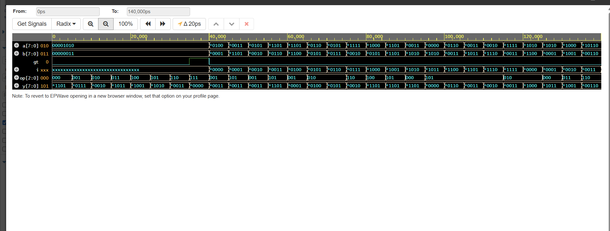

# Day 3 – Mini ALU (Verilog)

## Overview
This project implements a simple combinational ALU using pure Verilog.  
The design supports arithmetic, logical, and comparison operations.

## Operations
- ADD
- SUB
- AND
- OR
- XOR
- PASS A
- PASS B
- COMPARE (A > B)

## Verification
- Self-checking Verilog testbench
- Directed tests for each operation
- Random tests for robustness
- Waveforms generated using GTKWave

## Run Simulation
iverilog rtl/*.v tb/tb_alu.v -o sim.out
vvp sim.out
gtkwave waves_day3.vcd

## Waveform (Simulation Result)

The waveform above shows the verification of the Mini ALU operations.
Inputs `a`, `b`, and operation select `op` change over time, and the output `y`
correctly reflects the corresponding ALU operation (ADD, SUB, AND, OR, XOR, etc.).
