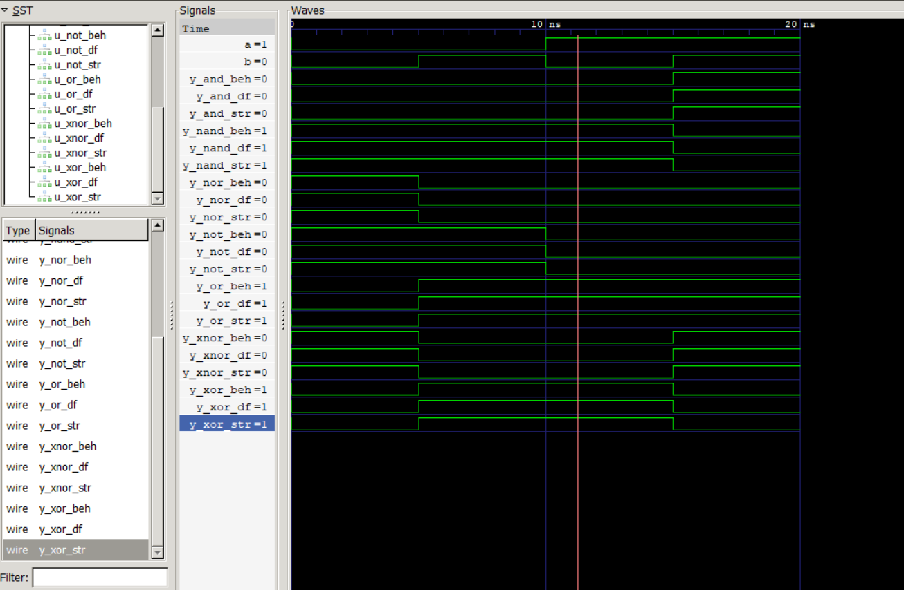

# All Logic Gates – All Modeling Styles (Verilog + SystemVerilog Testbench)

## Description
This project implements all basic logic gates (AND, OR, NOT, NAND, NOR, XOR, XNOR) using Verilog.  
The AND gate is implemented using all three modeling styles: dataflow, behavioral, and structural.  
A single self-checking SystemVerilog testbench is used to verify the correctness of all modules with exhaustive input combinations.

This project demonstrates strong fundamentals in digital logic design and verification, suitable for VLSI Design Verification fresher roles.

---

## Features
- Implementation of all basic logic gates  
- AND gate implemented using:
  - Dataflow modeling  
  - Behavioral modeling  
  - Structural modeling  
- Self-checking SystemVerilog testbench  
- Exhaustive testing for all input combinations  
- Clean, modular, and well-documented code  

---

## Files
- `and_gate_df.v` – AND gate (Dataflow)  
- `and_gate_beh.v` – AND gate (Behavioral)  
- `and_gate_str.v` – AND gate (Structural)  
- `or_gate_df.v` – OR gate  
- `not_gate_df.v` – NOT gate  
- `nand_gate_df.v` – NAND gate  
- `nor_gate_df.v` – NOR gate  
- `xor_gate_df.v` – XOR gate  
- `xnor_gate_df.v` – XNOR gate  
- `tb_all_gates.sv` – SystemVerilog self-checking testbench  

---

## Verification Methodology
- Directed and exhaustive testing of all input combinations  
- Self-checking mechanism to compare DUT outputs with expected values  
- Error reporting using `$display` for mismatches  

---

## How to Run (Using Icarus Verilog)
```bash
iverilog -g2012 *.v tb_all_gates.sv
vvp a.out
## Waveform (Simulation Result)



This waveform shows correct functionality of AND/OR/NOT/NAND/NOR/XOR/XNOR gates
across dataflow, behavioral, and structural modeling styles.

